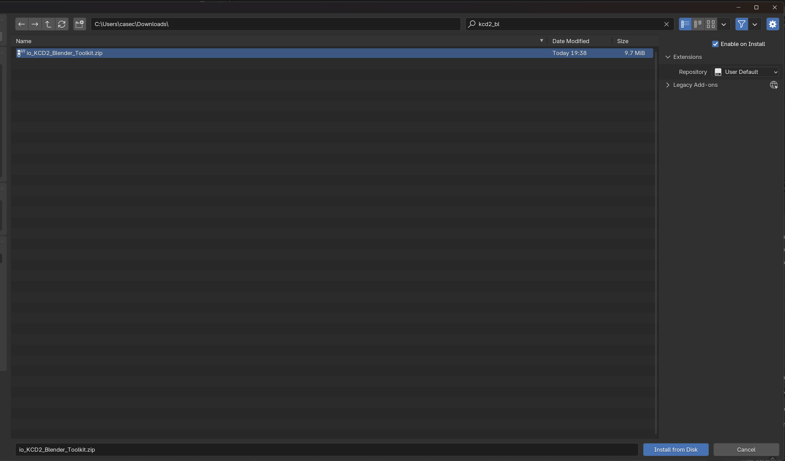
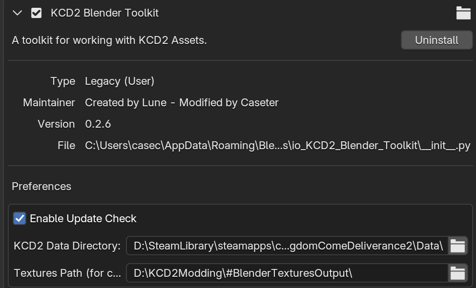

# Overview
Original plugin created by [Lune](https://github.com/LuneMods/KCD2-Blender-Toolkit) - Forked by Caseter & maintained with the support of the community.

Currently working as of Blender 4.3.

# Installation

Unlike Lune's original repo, this version is built into a single plugin folder rather than two. To install, please go the the [Releases](https://github.com/Caseter/KCD2-Blender-Toolkit/releases)

Once you download the ZIP folder, in Blender go to Edit > Preferences

Then go to Add-ons section, at the top right click the down arrown then Install from Disk

On the new window that opens select the ZIP folder you downloaded from releases, then clikc Install frm Disk

Once installed, find (or search at the top) the KCD2 Blender Toolkit plugin. Expand the panel and under Preferences direct it to your games Data folder, e.g:

<pre>
D:\SteamLibrary\steamapps\common\KingdomComeDeliverance2\Data
</pre>

Once done, you can close the addons/preferences panel. In the blender viewport if you press N on your keyboard you should now see the two panels on your right:

The final set up step is to direct BCry to your Resource Compiler (RC.exe from the official modding tools):

First click on `Find RC` and direct it to wherever you installed your modding tools, then into `\Tools\rc\rc.exe`

Repeat this process for `Find Texture RC`.

Once that is done you are ready to go. For some basic getting started info check out the tutorials and templates linked below.

# Tutorials & Templates

[Tutorials/Documentation](https://github.com/Caseter/KCD2-Blender-Toolkit/blob/main/Tutorials/Weapon%20Creation.md)

[Templates](https://github.com/Caseter/KCD2-Blender-Toolkit/tree/main/Templates)

# Current Features

Current features:
- Directly importing .skin & .cgf files
- Vertex Colors (RGB and Alpha layers)
- Exporting to .skin & .cgf using a custom branch of BCry Exporter

Assets mostly working:
- Weapons
- Helmets (need to modify the visor bone roll -180 deg in edit mode)
- Clothing
- Body Meshes (there might be some funky morphtargets missing but seems OK in practice?) 
